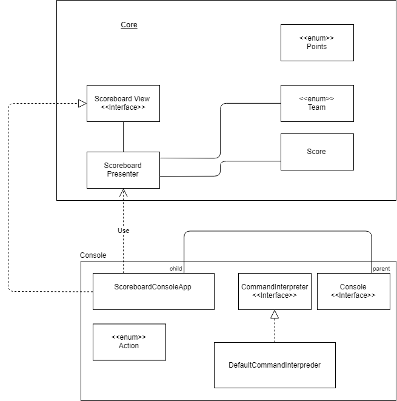

# scoreboard
Agile Developer Workshop - Scoreboard

1. Inside the scoreboard/console folder execute `mvn clean package assembly:single assembly:single`
2. Go to the [release page](https://github.com/jlink-workshop/scoreboard/releases) and create a new release
3. Open the release and upload the built binary from `console/scoreboard-app.zip`

## Architecture

### Core Package

The core package contains all business data models and functionality.
This encompasses things like score, teams and the logical parts of displaying score.

#### Points

A data type describing a valid increment by which to change a team's score.

#### Score

Score objects represent a game state containing two teams' scored points.

#### Team

There are two teams: Team A and team B.

#### Scoreboard View

The scoreboard view is a logical display interface that specifies the ability to display scores and teams.

#### Scoreboard Presenter

The scoreboard presenter is a controller that keeps a game's state.

### Console Package

The console package encapsulates the view functionality.

#### ScoreboardConsoleApp

`ScoreboardConsoleApp` is a console-based implementation of `ScoreboardView`.
This is the logical link between the core and console packages.

#### Action

An enumeration of the available commands.

#### CommandInterpreter

Converts (parses) strings into `Action` objects.

#### DefaultCommandInterpreter

Default implementation of `CommandInterpreter`. It supports long and short versions of commands.

#### Console

An abstraction of a console-based I/O interface that reads and writes lines.