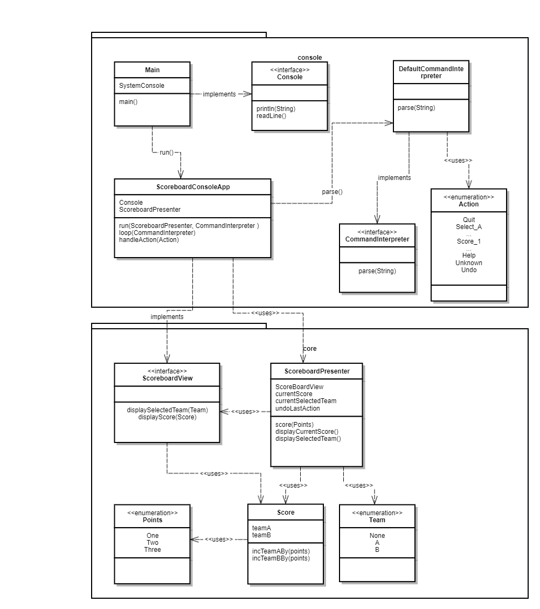

# scoreboard
Agile Developer Workshop - Scoreboard

Website is published on https://jlink-workshop.github.io/scoreboard/

# Architecture diagram

# Deployment instructions

Run buildAndDeploy.bat or buildAndDeploy.sh script (overwrites existing .jar in deployment folder), depending if you are on Windows or on MacOS, Unix, Linux. 
Push the newly created file ``scoreboard-console.jar`` under folder deployment to github server.
