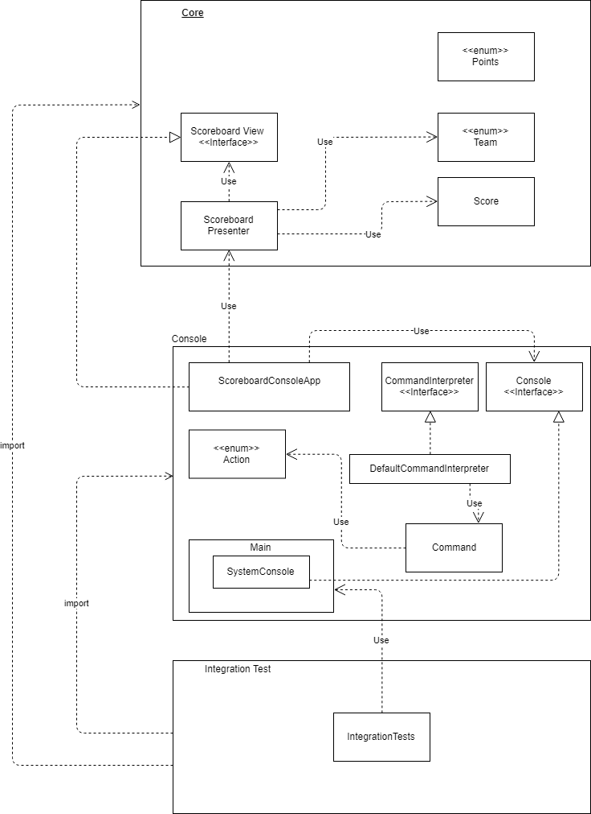

# The Scoreboard

The best scoring for the best teams...

## Initial installation

1. Download latest `scoreboard-app.zip` from [the releases page](https://github.com/jlink-workshop/scoreboard/releases).
2. Unpack the downloaded zip.

## Usage

Run included `run-app.bat` (Windows) or `run-app.sh` (Linux/MacOSX)

**Note: On MacOSX ensure you have appropriate user rights to execute the script (`chmod a+x run-app.sh`)**

**Note: On Windows you may have to run `run-app.bat` as administrator**

Type `help` or `h` to display the list of available commands.

## Architecture

